## 🎵 Enhanced Music Suggestion API

A FastAPI microservice that provides music suggestions using the YouTube Data API v3. The service analyzes a user's liked songs and returns similar tracks. It includes robust fallback mechanisms to always return relevant results when possible.

-Production URL: https://song-suggest-microservice.onrender.com


## ✅ API Contract

The REST API remains the same as V1

1) POST /suggestions
- Description: Get song suggestions based on multiple liked songs for a user.
- Request body (JSON):
```
{
  "user_id": "user-123",
  "songs": ["Shape of You", "Blinding Lights", "Watermelon Sugar"]
}
```
- Response (200):
```
{
  "suggestions": [
    {
      "title": "Queen - Somebody To Love",
      "artist": "Queen Official",
      "youtube_video_id": "kijpcUv-b8M"
    }
    // ... more suggestions
  ]
}
```
- Errors: 400 (bad input), 404 (no matches and fallback failed), 500 (configuration)

2) GET /liked-songs?user_id=xxx
- Returns the list of liked songs stored for the given user.

3) GET /health
- Returns `{ "status": "healthy" }` if the service is running.

---

## 🔍 ML Suggestion Engine (Overview)

Goal: Provide high‑quality, low‑latency song recommendations using only the YouTube Data API and lightweight in‑process modeling.

Core approach: Content‑based ranking with TF‑IDF over YouTube metadata
- Seed selection: For each input song string, the service searches YouTube (music category) and picks the top relevant video as the seed.
- Related candidates: Uses YouTube's related videos API to retrieve candidate music videos.
- Batch enrichment: Fetches candidate details in a single batch call (snippet, statistics, contentDetails) to minimize latency.
- Text features: Builds a text corpus from title + channel name + description + tags.
- TF‑IDF similarity: Computes TF‑IDF vectors and cosine similarity between the seed text and each candidate's text.
- Heuristic score: Combines content similarity with metadata signals such as:
  - Official video phrases in title
  - Word overlap with seed title
  - Same channel as seed
  - View count scaling (light popularity prior)
- Aggregation: Merges suggestions across multiple liked songs, deduplicates by video ID and title, sorts by score, and returns the top 5.

Caching and latency optimizations
- Per‑request in‑process cache with TTL for combined suggestions.
- Function‑level LRU cache for per‑song suggestion results.
- Batch video details fetch to reduce round trips to YouTube.

Fallback mechanisms
- If no suggestions are found across all liked songs, the service fetches from YouTube's most popular music videos (category 10). It prefers videos with high view counts and returns a high‑confidence popular track.
- If even the popular feed is unavailable, the API returns a 404 with a clear error message.

Persistence
- Liked songs are saved per user via SQLAlchemy using SQLite by default.
- Concurrent Postgres support via write-through replication is enabled when `POSTGRES_DATABASE_URL` (or a Postgres `DATABASE_URL`) is provided. Reads prefer Postgres by default and can be switched via `DB_READ_PREFERENCE`.
- 
Client Layer: External applications that consume the API
API Gateway: FastAPI with CORS middleware for cross-origin support
REST Endpoints: Three main endpoints for liked songs, suggestions, and health checks
Business Logic: Core functions handling song persistence, suggestion generation, and fallback mechanisms
Caching Strategy: Dual-layer caching with in-memory LRU cache and database-backed cache
ML Processing: TF-IDF vectorization and cosine similarity for intelligent song recommendations
Data Access Layer: SQLAlchemy ORM with multiple models for users, songs, and recommendations
External Integration: YouTube Data API v3 for fetching video metadata and suggestions
Storage: SQLite database for persistent storage
The architecture follows a clean separation of concerns with proper layering, caching for performance, and a fallback mechanism to ensure reliability.

```mermaid
%%{init: {"theme":"light"}%%
graph TB
  subgraph CLIENT["🎵 CLIENT LAYER"]
    Client["Client Applications\nWeb • Mobile • Desktop"]
  end

  subgraph GATEWAY["⚡ API GATEWAY"]
    CORS["CORS Middleware\nCross-Origin Resource Sharing"]
    FastAPI["FastAPI Server\nAsync • Fast • Modern"]
  end

  subgraph ENDPOINTS["🔌 REST ENDPOINTS"]
    GET_LIKED["GET /liked-songs\nRetrieve User Favorites"]
    POST_SUGGEST["POST /suggestions\nAI-Powered Recommendations"]
    GET_HEALTH["GET /health\nService Status Check"]
  end

  subgraph CORE["🎯 CORE LOGIC"]
    AUTH["Request Validator\nPydantic Models"]
    COMBINE["Suggestion Engine\ncombine_suggestions()"]
    YT_SUGGEST["YouTube Integration\nget_youtube_suggestions()"]
    FALLBACK["Fallback System\nget_popular_song_fallback()"]
    PERSIST["Like Persistence\n_persist_user_likes()"]
    LOAD["Like Retrieval\n_load_user_likes()"]
  end

  subgraph CACHE["💾 CACHING SYSTEM"]
    MEM_CACHE["Memory Cache\nLRU Cache\nTTL: 3600s"]
    DB_CACHE["Database Cache\nQueryCache Table"]
  end

  subgraph ML["🤖 ML PIPELINE"]
    TFIDF["TF-IDF Vectorizer\nText Feature Extraction"]
    COSINE["Cosine Similarity\nContent Matching"]
    SCORING["Scoring Algorithm\nHeuristic + ML Fusion"]
  end

  subgraph DATA["📊 DATA LAYER"]
    SESSION["SQLAlchemy ORM\nSession Management"]
    subgraph MODELS["Database Models"]
      USER_MODEL["User"]
      LIKED_MODEL["UserLikedSong"]
      SONG_MODEL["Song"]
      REC_MODEL["Recommendation"]
      VIDEO_MODEL["VideoFeature"]
      CACHE_MODEL["QueryCache"]
    end
  end

  subgraph EXTERNAL["🌐 EXTERNAL APIS"]
    YOUTUBE["YouTube Data API v3\nSearch • Videos • Related"]
  end

  subgraph STORAGE["🗄️ STORAGE"]
    SQLITE["SQLite Database\nmusic_recommender.db"]
  end

  %% Request Flow
  Client -->|HTTPS| CORS
  CORS --> FastAPI
  FastAPI --> GET_LIKED
  FastAPI --> POST_SUGGEST
  FastAPI --> GET_HEALTH

  %% GET /liked-songs flow
  GET_LIKED -.->|Validate| AUTH
  AUTH -.-> LOAD
  LOAD -.-> SESSION
  SESSION -.-> USER_MODEL
  SESSION -.-> LIKED_MODEL

  %% POST /suggestions flow
  POST_SUGGEST -->|Validate| AUTH
  AUTH --> PERSIST
  PERSIST --> SESSION
  AUTH --> COMBINE
  COMBINE -->|Cache Hit?| MEM_CACHE
  COMBINE -->|Cache Miss| YT_SUGGEST
  YT_SUGGEST -->|API Call| YOUTUBE
  YOUTUBE -->|Video Data| TFIDF
  TFIDF --> COSINE
  COSINE --> SCORING
  SCORING --> COMBINE
  COMBINE -->|Fallback| FALLBACK
  FALLBACK -->|API Call| YOUTUBE
  COMBINE -->|Store| MEM_CACHE

  %% Database connections
  SESSION --> SQLITE
  USER_MODEL -.-> SQLITE
  LIKED_MODEL -.-> SQLITE
  SONG_MODEL -.-> SQLITE
  REC_MODEL -.-> SQLITE
  VIDEO_MODEL -.-> SQLITE
  CACHE_MODEL -.-> SQLITE
  DB_CACHE -.-> CACHE_MODEL

  %% Spotify-inspired styling
  classDef spotifyGreen fill:#1DB954,stroke:#FFFFFF,stroke-width:2px,color:#000000
  classDef spotifyBlack fill:#191414,stroke:#1DB954,stroke-width:2px,color:#FFFFFF
  classDef spotifyGray fill:#212121,stroke:#1DB954,stroke-width:1px,color:#FFFFFF
  classDef spotifyWhite fill:#FFFFFF,stroke:#1DB954,stroke-width:2px,color:#000000
  classDef spotifyAccent fill:#1ED760,stroke:#FFFFFF,stroke-width:2px,color:#000000
  classDef externalStyle fill:#535353,stroke:#1DB954,stroke-width:2px,color:#FFFFFF

  class GET_LIKED,POST_SUGGEST,GET_HEALTH spotifyGreen
  class Client,FastAPI spotifyAccent
  class AUTH,COMBINE,YT_SUGGEST,FALLBACK,PERSIST,LOAD spotifyBlack
  class MEM_CACHE,DB_CACHE,SESSION spotifyGray
  class TFIDF,COSINE,SCORING spotifyWhite
  class YOUTUBE externalStyle
  class SQLITE spotifyGray
  class USER_MODEL,LIKED_MODEL,SONG_MODEL,REC_MODEL,VIDEO_MODEL,CACHE_MODEL spotifyGray
  class CORS spotifyBlack
```


<!-- This is an auto-generated reply by CodeRabbit -->




The fix involved removing spaces after commas in the class assignments. The diagram now properly renders with the Spotify-inspired dark theme and green accents as intended.

_Originally posted by @coderabbitai[bot] in https://github.com/Agrannya-Singh/Tune_Trace_backend/issues/1#issuecomment-3173417275_
            

---

## 🔌 Usage Examples

curl (POST /suggestions)
```
curl -X POST \
  https://song-suggest-microservice.onrender.com/suggestions \
  -H "Content-Type: application/json" \
  -d '{
        "user_id": "demo-user",
        "songs": ["Blinding Lights", "Shape of You"]
      }'
```

curl (GET /liked-songs)
```
curl "https://song-suggest-microservice.onrender.com/liked-songs?user_id=demo-user"
```

curl (GET /health)
```
curl "https://song-suggest-microservice.onrender.com/health"
```

---

## 🌐 Frontend Integration

No changes required on the frontend. Continue calling the same endpoints and parsing the same JSON structure. Example (fetch):
```
async function getSuggestions(userId, songs) {
  const res = await fetch("https://song-suggest-microservice.onrender.com/suggestions", {
    method: "POST",
    headers: { "Content-Type": "application/json" },
    body: JSON.stringify({ user_id: userId, songs })
  });
  if (!res.ok) throw new Error(`HTTP ${res.status}`);
  const data = await res.json();
  return data.suggestions;
}
```

---

## ⚙️ Configuration

Environment variables (Render -> Environment)
- YOUTUBE_API_KEY: Required.
- SQLITE_DATABASE_URL: Optional. Defaults to `sqlite:///app.db`.
- POSTGRES_DATABASE_URL: Optional. Render Postgres connection URL. If omitted but `DATABASE_URL` is set to a Postgres URL, it will be used.
- DATABASE_URL: Backward-compatibility for Postgres.
- DB_READ_PREFERENCE: `postgres` (default) or `sqlite`.
- REDIS_URL: Optional. Render internal Redis URL (free tier supported).
- REDIS_TTL_SECONDS: Optional. Default `3600`.

Start command (Render)
```
uvicorn main:app --host 0.0.0.0 --port $PORT
```

Dependencies
- See `requirements.txt`. Includes SQLAlchemy and scikit‑learn for the ranking logic.

CORS
- CORS is set to allow all origins by default for ease of integration. Restrict in production as needed.

---

## 🚀 Deployment Notes for Render

- Ensure YOUTUBE_API_KEY is set as a secret.
- If using Render Postgres, set POSTGRES_DATABASE_URL (or DATABASE_URL with a Postgres URL).
- If using Render Redis, set REDIS_URL to the internal connection string.
- Build and runtime are standard; scikit‑learn is included for TF‑IDF and cosine similarity. Render will build wheels automatically; no extra steps typically required.

---

## 🔎 Health Check
```
GET https://song-suggest-microservice.onrender.com/health
Response: { "status": "healthy" }
