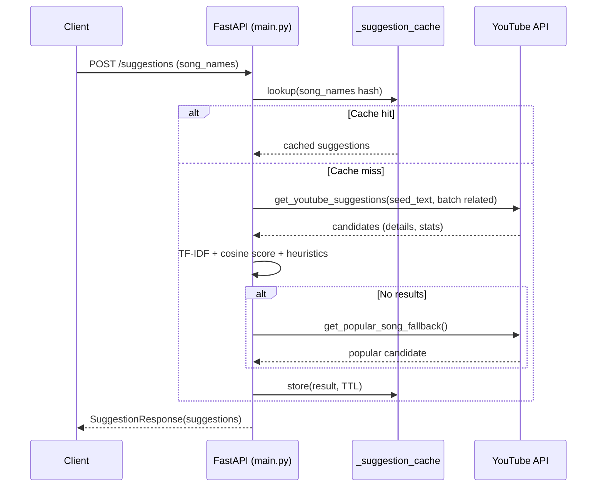
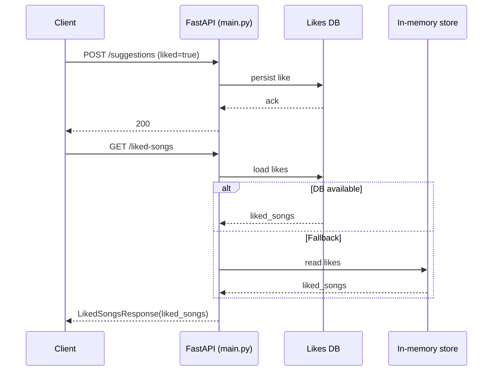

<!-- This is an auto-generated comment: summarize by coderabbit.ai -->
<!-- walkthrough_start -->

## Walkthrough
Introduces DB-backed persistence for likes with an app startup hook, adds in-process caching for combined suggestions, rewrites YouTube suggestion retrieval and scoring with TF-IDF and cosine similarity, adds a popular-song fallback, extends public Pydantic models and responses, replaces rate-limit decorators with LRU caching, and improves logging.

## Changes
| Cohort / File(s) | Summary of Changes |
|---|---|
| **App startup & DB persistence** `main.py` | Added on_startup() to initialize DB. Added helpers to persist/load user likes. Endpoints now store likes on POST /suggestions and read via GET /liked-songs with in-memory fallback. |
| **Suggestion caching and combination** `main.py` | Introduced _suggestion_cache with TTL (CACHE_TTL). combine_suggestions uses cache, deduplicates and ranks results, and invokes fallback when empty. |
| **YouTube suggestions algorithm rewrite** `main.py` | get_youtube_suggestions rebuilt: constructs seed_text, batch-fetches related items with rich fields, filters ultra-short videos, applies TF-IDF + cosine similarity scoring with multiple heuristic boosts, returns top 10 capped scores. Added @lru_cache(maxsize=128). |
| **Fallback mechanism** `main.py` | Added get_popular_song_fallback() using YouTube mostPopular chart; returns a single candidate when no suggestions found. |
| **Public models and API contracts** `main.py` | Added Pydantic models: Song, SongSuggestion, SuggestionResponse, LikedSongsResponse. Public API now returns typed responses aligning with these models. |
| **Misc/imports/logging/decorators** `main.py` | Included imports for DB session, TF-IDF, cosine similarity. Replaced prior rate-limit decorators with LRU cache. Added error logging around API/network failures. |

## Sequence Diagram(s)

## Estimated code review effort
🎯 3 (Moderate) | ⏱️ ~20 minutes

## Poem
> I cached a tune in clover’s shade,  
> Scored rhythms TF-IDF-made.  
> If silence falls and leads astray,  
> I hop to charts to find a way.  
> With likes in burrowed DB nooks—  
> I thump, then serve the freshest hooks.  
> Carrots queued, suggestions played.

<!-- walkthrough_end -->
<!-- internal state start -->

<!-- DwQgtGAEAqAWCWBnSTIEMB26CuAXA9mAOYCmGJATmriQCaQDG+Ats2bgFyQAOFk+AIwBWJBrngA3EsgEBPRvlqU0AgfFwA6NPEgQAfACgjoCEejqANiS7xmvfFNoGActmYDKXAIwGAqok9IAEEiKgwMWTQwAGV4DCJYI31jcCgyenwAMxwCYjJlGnomVnYuXn5hUXEpGXkmJSpVdS0dZJMoOFRUTBzCUnIqQoUSjE5IKgB3SEQ3ZjQKeTkFBpU1TW1dMEMU0wM5uI1uWQ4DACJzgwBiS+CASTyB6jpp2fn5LMZYTFJEJMgAEQAQmABGgGABrZ7cSiIJA0DAMEiQTL4PjYAJ8CzwSGIE6QXTBWhKeiIXDzXDYbiQWD4fDgyAEFAYdTwNBYgBeSKBkAAFHF1AB9WgCACU/CwaG4VNJ5MpGgM+KgAAUAPLRaCQAD0MyIP3E+AwyAw+Cm0IosNJyHRlEgWJxDPwAMBAG5IABxACiGs1droYEQBqIyAs+DQtGD2OkyIoLCdvIm6lgTLAbGYqPkmTZFlBEJF8sVkGcJCmcRoFAwbOpJAsZuQjNrcJ9ofovuQcTjPONuB45P42W42AEWIYwSVt0gAjwkDIKix8R4MLhZEReb+twwYHsiMQyAYYIQ88w9EzFmzYPBeIJ69wMdo2ER9DQL110n1WD3DFgSJ5Ap1evgBoCh+X5igmuBJtA0AADK8gAwkEsEABIegKkFQWKjIUHQ95IlhxQDmSb75gSxRqOQv7YC+pIAYakDWnWX6MPuSKMhiUjjCQ0JPPQWEAI7YK+yAonw4FIogaBsNMgbTCQmh/AAmvg2DQIOYmUf+BpCSGUw8lhEwUOo8IADQ8IOw7ItgCJvhOJBfBIAFogiXzxHQIqXlApC4AKshKRSHgUVRb5GiadEBMgT4BHQAo0AAHt2k7wBY3aZDGzAMoxqLwEQcSVvZSiOkeyKyZ+UZYRY3EoDQzBtlgoK4J+kBgUmBmTqSkBKGSiXIDyiDMlKskmUwozsP8snaBYiAmTK4jUQwiAYY6wlpQZJV8HuGC0PAtBPAyJBxYgxEdAAYmAtz/EdkAANQKLC5GwswiXzOosggmgAQkkwBnzt0RJ0Fw62bdtNDRXtuDhVhkBSGImWcrQrr3Y9Bm4PIrEkFFsXdnEmQWAJCJRogn3fhMJBZbAQxLF4GgAKyrgW0SfXERBVtgBmzXR3BA39E5vSQv6E9MZIUGD6DdpTAAMrpxAwWFsKMQmopAgA4BFkmTwAwrIWJDW0kPggC4BLyYsaAAHCKJniLgVhgEN8Ldg4lDlVSPKGzTU0SUin6YOQmtOxoAAspvoBtWvFogr3vROtJtT7ADMC58A9p40cHEzza62BJVQ/o0kLWv5d1wBeJAD0YGK8xIqrSWUM8vmHZAsFHltO0BFYYhJwlFjhsMZHo6D0axubViDc5XsmUoBMGdwb4mYVZJBq6WEUuWVpUoyXhixxMxJcgAZC88SwE6iSKFXu/WPt2vsaIbCoEgASpx5UPjwWH2UpyBKJ91CosgTWQAAAhYFBsBAWYjyOYMVYScgALxeAAEwm2RArTy3lfKqQChpQ0tdoho1oCDOKgceLVm4qdf43N6pJkyMVJMth7BSFlsLLCd5ESjnHHuU84Ug7UJjOxMqJAJCYERPKAwUAjpZhzPSNgHtmSIGYO5QkxJIBIO4PgAc5UKC/kDAKE8Z4IQ8gWkVMh6AeDKPTvMSAillKqU+L2dgCxGpfiwMaZ86DwblyUhtEy6JGZWKFpAtMpIlTGNUfg5EiUyxeOEtSUmYB7Ih3nrJFmtEIqMysExDajcaCNUTIY0EARpj8w+OLQRyozJq3atQJ8aYlATWCUEMcLwKCZkRLIospoSkjkqdWXEkBojSR6hoisbAuCkgoAHHp8RojqVfEnHkA8SDTyFnCEyPk8CoLyjrAUW0pqE1GZM6iBo76ICUYab8f4pmaS4FBOEABtMZRAJmBRogAXQDpcyEtBbmIAOUc3JPJfQ4IDPELplzSRXOGc82ucBpBH0onQ9KSJanjmRtCK04cliiScWcrA6QlGlgOn8JUbTmE2Tsg5KxLluqCDYrOEgblr5QFInEXmpy9m0WNFMYCpVpDp2FoVXgDkWScjfthbgw5uImTCG8je3LECS2yCQOwyMzYGRfOaZEojzxFMgAAWSQAwWRQRfoEP4vABhKA7ComFhE7kWCdw0RMtAE6Z0jrTyDkwW6YlbCI2erXHVxo+CUBjHwZytA5xMzIM5REdDuohl1OEhWCLNTkFwBMVE9JMyJRZtIVcRgrg3CCJXQYNE6yOnRe/VR1Ai19mnDFJRu8Mh8AHEOUp7AWTSD+EdSyrcDToENVwAABoBGUQtKS6L7UySAfb9gYEOLIMdPJ36ogqj/Ptv9JTcA0IBXh7AeSnCHRSbgpwRR9rFJAIRkAO1WSTmGYk/bFGBPmOo+Imj1U6KPeOyd2hp1HDHaeqAsFyo7h7TeidtyeSAh5lqxQ1Y30/1hEQCsi8kR9oBUQAUAzrACwoGO9sH6DjfvxGe/9b1wq9pA4Ge56CwMQagxYGDWS4MIczRO2ZQybx9pMn28kcJWNYY48svyvM1n4A2bQHj7GJ0HywlwbGoZcDYawLhr9s6CN/oAyR4DfaKOYq+ZpEgVGAiQaqXR8C0wsqMYhsh3ZQULnXNuVplljz5MTqnTOn9hG1NAa5n215dAPk6eOfpkghnoNjtg2Z6gTG+1/MfUGGzIKwVOcU65lTAJRCLoIGtZypBb2yWQSs/yzKgpjrZdSN6E7/6AOASVUBaBwHwCgbAk2c6sIirBF4vlCsV2ICsJxAUR4BQLwWH2zUK6sQPTBselLF6u1YEpJzUTE6GV3Ss0WvpT70NAuuWCsUWxIDAtwFczaYhHOQBK/RQOyYtzSF3MxYJHLkBYU3mDeG4XEN0Sct8OgRgPTUTmEMeouFeHwGLNOTIwkxiIVJmcC4Qitg7DSEHD4aA8B9HyIMZ4xQ6FcEmC8VgbwJx1Cg40NYLRNiGHaMMcbInEADaB8WKKe6yfw/ajAgAbKIX2rPaDR0yL7OBvtfYAHZfYAE5tqZC8F4JQ0c0BeCpnLgQVNfYCC50bWg69kgGAp5jwUW0afP2B8THB6QmcU+YAwbgQEDQY1/ILbsmu+2O4MAAb2vqcOIcGyaIFOFwK5jyjJu4mPMZkgKfeQD9wYAAvgYR3fbmfm8t9bUGAoTf6CAA= -->

<!-- internal state end -->
<!-- finishing_touch_checkbox_start -->

✨ Finishing Touches

- [ ] <!-- {"checkboxId": "7962f53c-55bc-4827-bfbf-6a18da830691"} --> 📝 Generate Docstrings

🧪 Generate unit tests

- [ ] <!-- {"checkboxId": "f47ac10b-58cc-4372-a567-0e02b2c3d479", "radioGroupId": "utg-output-choice-group-unknown_comment_id"} -->   Create PR with unit tests
- [ ] <!-- {"checkboxId": "07f1e7d6-8a8e-4e23-9900-8731c2c87f58", "radioGroupId": "utg-output-choice-group-unknown_comment_id"} -->   Post copyable unit tests in a comment
- [ ] <!-- {"checkboxId": "6ba7b810-9dad-11d1-80b4-00c04fd430c8", "radioGroupId": "utg-output-choice-group-unknown_comment_id"} -->   Commit unit tests in branch `Ml_logic`

<!-- finishing_touch_checkbox_end -->
<!-- tips_start -->

---

Thanks for using CodeRabbit! It's free for OSS, and your support helps us grow. If you like it, consider giving us a shout-out.

### Other keywords and placeholders

-

<!-- tips_end -->

_Originally posted by @coderabbitai[bot] in https://github.com/Agrannya-Singh/Tune_Trace_backend/issues/1#issuecomment-3173336291_
#this review was performed automatically by coderabbit ai
            
