<!-- This is an auto-generated reply by CodeRabbit -->

```mermaid
graph TB
    %% Environment & Configuration
    subgraph ENV["🔧 Environment Configuration"]
        direction TB
        ENV1["DATABASE_URL<br/><i>Legacy PostgreSQL</i>"]
        ENV2["SQLITE_DATABASE_URL<br/><i>Default: sqlite:///app.db</i>"]
        ENV3["POSTGRES_DATABASE_URL<br/><i>Production Database</i>"]
        ENV4["DB_READ_PREFERENCE<br/><i>Default: postgres</i>"]
        ENV5["REDIS_URL<br/><i>Optional Redis Server</i>"]
        ENV6["REDIS_TTL_SECONDS<br/><i>Default: 3600s</i>"]
        ENV7["YOUTUBE_API_KEY<br/><i>External API Access</i>"]
    end

    %% Caching Architecture (Multi-Tier)
    subgraph CACHE_ARCH["🚀 Multi-Tier Caching Architecture"]
        direction TB
        
        subgraph L1["Level 1: Distributed Cache"]
            REDIS["🔴 Redis Cache<br/>---<br/>• Distributed & Persistent<br/>• TTL: 3600s configurable<br/>• Key: suggestions:{cache_key}<br/>• Graceful degradation<br/>• JSON serialization"]
        end
        
        subgraph L2["Level 2: Application Cache"]
            IN_MEM_CACHE["💾 In-Memory Suggestion Cache<br/>---<br/>• Per-instance cache<br/>• TTL: 3600s<br/>• Timestamp-based expiry<br/>• Fallback for Redis"]
        end
        
        subgraph L3["Level 3: Compatibility Cache"]
            LIKED_STORE["📦 Liked Songs Store<br/>---<br/>• Backward compatibility<br/>• In-memory per-instance<br/>• User preference cache"]
        end
        
        subgraph L4["Level 4: Function Cache"]
            LRU_CACHE["🔄 LRU Cache<br/>---<br/>• @lru_cache decorator<br/>• Max size: 128<br/>• YouTube API responses"]
        end
        
        subgraph L5["Level 5: Persistent Query Cache"]
            DB_CACHE["🗃️ Database QueryCache<br/>---<br/>• Persistent across restarts<br/>• Query result caching<br/>• best_video_id mapping"]
        end
    end

    %% Database Architecture
    subgraph DB_ARCH["🗄️ Dual Database Architecture"]
        direction TB
        
        subgraph ENGINES["Database Engines"]
            SQLITE_ENG["SQLite Engine<br/>check_same_thread: False"]
            POSTGRES_ENG["PostgreSQL Engine<br/>Production Grade"]
        end
        
        subgraph SESSIONS["Session Management"]
            SQLITE_SES["SQLite SessionMaker"]
            POSTGRES_SES["PostgreSQL SessionMaker"]
        end
        
        subgraph PHYSICAL["Physical Storage"]
            SQLITE_DB["🗄️ SQLite Database<br/>app.db"]
            POSTGRES_DB["🐘 PostgreSQL Database<br/>Production Instance"]
        end
    end

    %% Data Models
    subgraph MODELS["📊 Data Models & Relationships"]
        direction TB
        USER_MODEL["👤 User<br/>---<br/>• id: int (PK)<br/>• user_id: str (UK)<br/>• created_at: datetime<br/>• Relationship: 1:N likes"]
        
        LIKES_MODEL["🎵 UserLikedSong<br/>---<br/>• id: int (PK)<br/>• user_id: int (FK)<br/>• song_name: str<br/>• created_at: datetime<br/>• Unique: (user_id, song_name)"]
        
        VIDEO_MODEL["📹 VideoFeature<br/>---<br/>• id: int (PK)<br/>• video_id: str (UK)<br/>• title, channel_title<br/>• tags, description: text<br/>• view_count: int<br/>• duration, updated_at"]
        
        QUERY_MODEL["🔍 QueryCache<br/>---<br/>• id: int (PK)<br/>• query: str (UK)<br/>• best_video_id: str<br/>• updated_at: datetime"]
    end

    %% Operations Layer
    subgraph OPS["⚡ Database Operations"]
        direction LR
        READ_OPS["📖 Read Operations<br/>get_read_session()"]
        WRITE_OPS["✍️ Write Operations<br/>get_write_sessions()"]
        INIT_OPS["🚀 Database Initialization<br/>init_db()"]
    end

    %% Application Layer
    subgraph APP_LAYER["🌐 Application Layer"]
        direction TB
        FASTAPI["🚀 FastAPI Application<br/>---<br/>• CORS middleware<br/>• Environment validation<br/>• Graceful startup/shutdown"]
        
        YOUTUBE_API["🎬 YouTube Data API<br/>---<br/>• Music recommendations<br/>• Video metadata<br/>• Search & filtering"]
    end

    %% External Services
    subgraph EXTERNAL["🌍 External Services"]
        REDIS_SERVER["🔴 Redis Server<br/>Optional External Cache"]
        YT_SERVICE["🎬 YouTube API Service<br/>Google Cloud Platform"]
    end

    %% Connections - Environment to Services
    ENV5 -.-> REDIS_SERVER
    ENV7 --> YT_SERVICE
    ENV2 --> SQLITE_ENG
    ENV3 --> POSTGRES_ENG
    ENV1 --> POSTGRES_ENG

    %% Connections - Caching Flow
    REDIS_SERVER --> REDIS
    REDIS --> IN_MEM_CACHE
    IN_MEM_CACHE --> LIKED_STORE
    LIKED_STORE --> LRU_CACHE
    LRU_CACHE --> DB_CACHE

    %% Connections - Database Flow
    SQLITE_ENG --> SQLITE_SES
    POSTGRES_ENG --> POSTGRES_SES
    SQLITE_SES --> SQLITE_DB
    POSTGRES_SES --> POSTGRES_DB

    %% Connections - Operations
    ENV4 --> READ_OPS
    READ_OPS --> POSTGRES_SES
    READ_OPS -.-> SQLITE_SES
    WRITE_OPS --> SQLITE_SES
    WRITE_OPS --> POSTGRES_SES
    INIT_OPS --> SQLITE_ENG
    INIT_OPS --> POSTGRES_ENG

    %% Connections - Application Flow
    FASTAPI --> READ_OPS
    FASTAPI --> WRITE_OPS
    FASTAPI --> INIT_OPS
    FASTAPI --> REDIS
    FASTAPI --> IN_MEM_CACHE
    FASTAPI --> LIKED_STORE
    YOUTUBE_API --> LRU_CACHE
    YT_SERVICE --> YOUTUBE_API

    %% Model Relationships
    USER_MODEL --> LIKES_MODEL
    QUERY_MODEL --> DB_CACHE

    %% Dark Theme Styling
    classDef primaryBg fill:#1a1a1a,stroke:#4fc3f7,stroke-width:3px,color:#ffffff
    classDef cacheBg fill:#0d1421,stroke:#ff6b6b,stroke-width:2px,color:#ffffff
    classDef dbBg fill:#1a2332,stroke:#4caf50,stroke-width:2px,color:#ffffff
    classDef modelBg fill:#2d1b3d,stroke:#ab47bc,stroke-width:2px,color:#ffffff
    classDef opsBg fill:#1b2e1b,stroke:#66bb6a,stroke-width:2px,color:#ffffff
    classDef extBg fill:#3d2914,stroke:#ff9800,stroke-width:2px,color:#ffffff
    classDef envBg fill:#2e2e2e,stroke:#ffc107,stroke-width:2px,color:#ffffff

    %% Apply Styles
    class ENV1,ENV2,ENV3,ENV4,ENV5,ENV6,ENV7 envBg
    class REDIS,IN_MEM_CACHE,LIKED_STORE,LRU_CACHE,DB_CACHE cacheBg
    class SQLITE_ENG,POSTGRES_ENG,SQLITE_SES,POSTGRES_SES,SQLITE_DB,POSTGRES_DB dbBg
    class USER_MODEL,LIKES_MODEL,VIDEO_MODEL,QUERY_MODEL modelBg
    class READ_OPS,WRITE_OPS,INIT_OPS opsBg
    class FASTAPI,YOUTUBE_API primaryBg
    class REDIS_SERVER,YT_SERVICE extBg

    %% Background Theme
    %%{init: {'theme':'dark', 'themeVariables': {'primaryColor':'#1a1a1a','primaryTextColor':'#ffffff','primaryBorderColor':'#4fc3f7','lineColor':'#666666','sectionBkgColor':'#0f0f0f','altSectionBkgColor':'#1a1a1a','gridColor':'#333333','tertiaryColor':'#2d2d2d'}}}%%
```

## 🎯 Architecture Highlights

**🔥 Multi-Tier Caching Strategy:**
- **Level 1**: Redis (Distributed, 1-hour TTL)
- **Level 2**: In-memory suggestions cache (Per-instance fallback)
- **Level 3**: Liked songs store (Backward compatibility)
- **Level 4**: LRU cache (YouTube API responses, 128 entries)
- **Level 5**: Database QueryCache (Persistent query results)

**⚡ Performance Features:**
- Write-through dual database strategy
- Graceful Redis degradation
- Configurable cache TTL
- Smart cache key generation
- JSON serialization for complex data

**🛡️ Reliability & Resilience:**
- Optional Redis with fallback mechanisms
- Dual database redundancy
- Environment-based configuration
- Connection validation and error handling
- Backward compatibility maintenance

_Originally posted by @coderabbitai[bot] in https://github.com/Agrannya-Singh/Tune_Trace_backend/issues/6#issuecomment-3234222200_
            
